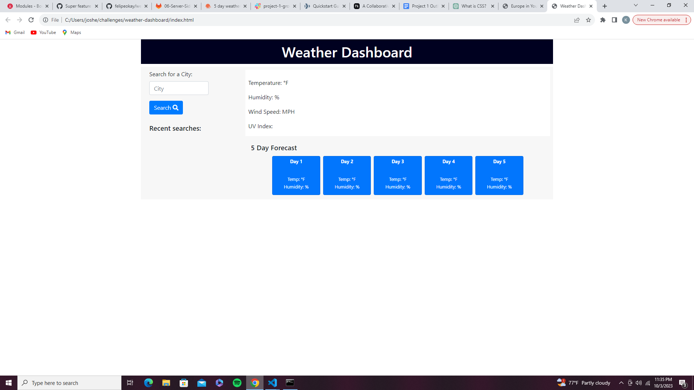

# Weather-Dashboard

## Description

This challenge was definetely a challenge. In this module I learned how to use access keys from third-party APIs and implement them into a useful application like a weather dashboard. Bootstrap was used in the HTML file with some hard coding in CSS. The star of the show is Javascript alongside with Jquery. Psuedo coding can be seen all over each file helping other developers if come across this repository. 

## Author

Follow me on Github at [felipeokay](https://github.com/felipeokay) 

For any questions please contact me via email at: Kevinserrano0823@gmail.com